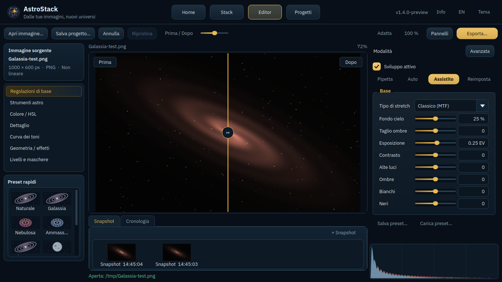
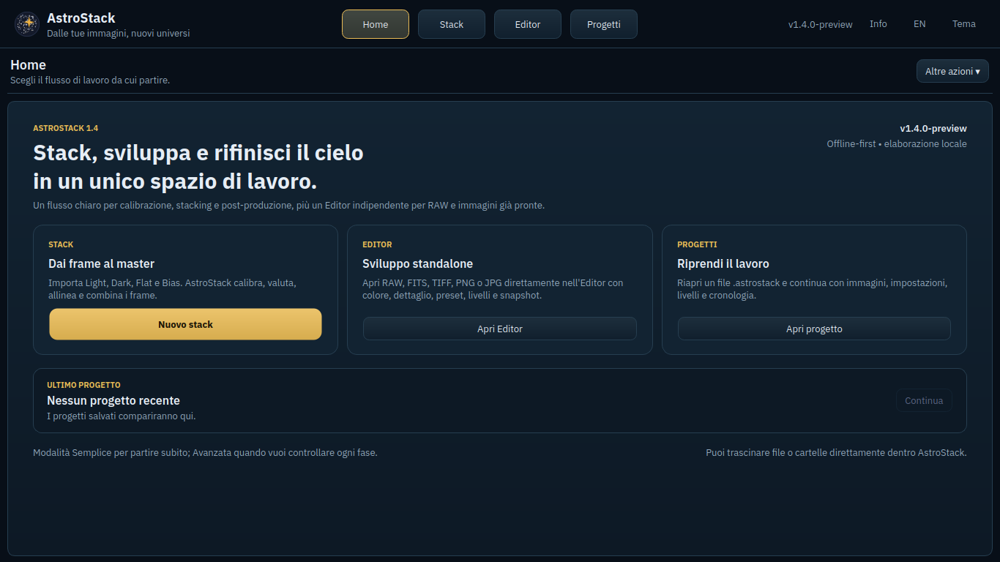
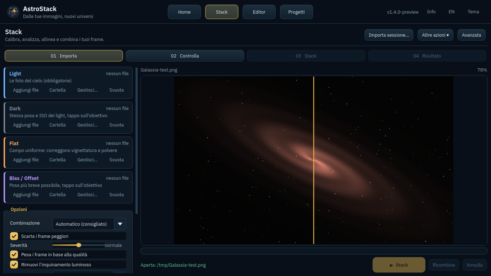

# AstroStack 1.4 — interfaccia desktop

Rifacimento sul checkpoint `astrostack-1.4-ui` (`6b1f8bb`), basato sui render approvati.
L'app rimane una GUI desktop PySide6 con il motore di elaborazione esistente.

## Cambiamenti

- Navigazione Home / Stack / Editor / Progetti in alto, tema blu notte e accento oro.
- Editor standalone a tre colonne: sorgente/categorie/preset, immagine centrale, regolazioni.
- Categorie Base, Astro, Colore/HSL, Dettaglio, Curve, Geometria/Effetti, Livelli/Maschere.
- Regolazioni esistenti riutilizzate; riduzione stelle e deconvoluzione raggruppate in Astro.
- Pannelli ridimensionabili con larghezze memorizzate; modalità Semplice/Avanzata accessibile.
- Barra Apri, Salva progetto, Annulla, Ripristina, Confronto, Adatta, 100%, Pannelli, Esporta.
- Confronto Prima/Dopo con maniglia trascinabile nelle coordinate dell'immagine.
- Snapshot con miniature, ordinamento stabile e miniature persistenti nei progetti; cronologia separata.
- Stack con accessi Importa / Controlla / Stack / Risultato e menu per le funzioni esistenti.
- Stato vuoto per l'Editor e controlli disabilitati quando manca un'immagine.
- Corretti i riferimenti alla vecchia Home nei callback di salvataggio e la prima operazione di annullamento.
- Rimossi i confronti con altre applicazioni dai testi pubblici, conservando i metodi.

## Avvio dal checkout

```powershell
cd source\app
python main.py
```

Scorciatoie aggiunte: `Ctrl+O` apre un'immagine, `Ctrl+Shift+S` salva il progetto,
`Ctrl+Shift+E` esporta, `Tab` nasconde/ripristina i pannelli nell'Editor.
Rimangono disponibili Annulla/Ripristina e il confronto tramite Spazio.

## Verifiche

Eseguiti su Linux con Qt offscreen:

```text
python source/app/tests/test_ux_v14.py
python source/app/tests/test_render_workspace.py
python source/app/tests/test_assisted_140.py
python source/app/tests/regression_editor_stack_v12.py
```

Il test della nuova interfaccia apre un PNG sintetico, modifica realmente i pixel,
esegue annulla/ripristina, ripristina snapshot, salva e riapre un progetto con miniature,
trascina il confronto, controlla pannelli e navigazione, cambia tema/lingua ed esporta
un TIFF RGB a 16 bit. Layout verificato a 1120×680, 1366×768, 1920×1080 e 2560×1440
(pixel logici Qt). Le immagini sotto sono catture dell'app in esecuzione con una
fixture sintetica, non render promozionali.

La pipeline `build-offline-windows.yml` prepara ora lo ZIP portabile 1.4 dai sorgenti
esatti del checkout, senza riscrivere la versione o i moduli dell'interfaccia.
Include launcher nativo Windows GUI, Python 3.12.10 privato e tutte le dipendenze.
`BUILD-MANIFEST.json` registra commit, versioni delle librerie e hash dei file.

La pipeline verifica lo ZIP estratto in un percorso con spazi: runtime isolato,
manifest, test funzionali, export TIFF e avvio reale di AstroStack.exe con il plugin
Qt Windows e senza finestra console. La rete per Python è disabilitata durante
le prove mediante proxy non raggiungibile e PIP_NO_INDEX. Il pacchetto viene
pubblicato come artifact verificato soltanto se tutti i controlli hanno successo.
Le schermate e il rapporto del launcher sono in un artifact separato.

Per costruire su Windows con Python 3.12 e Go installati: `./source/build_portable.ps1`.
La compilazione richiede Internet; l'utente finale estrae lo ZIP e apre AstroStack.exe.
Lo stato effettivo della verifica Windows è quello del run GitHub Actions del commit.
Le funzioni avanzate mantengono i limiti dei rispettivi algoritmi già presenti.




